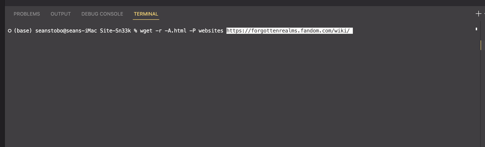
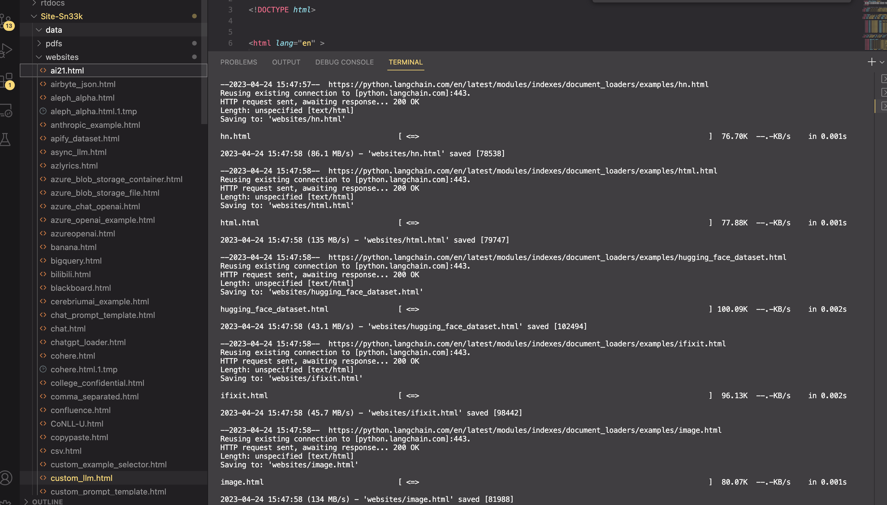
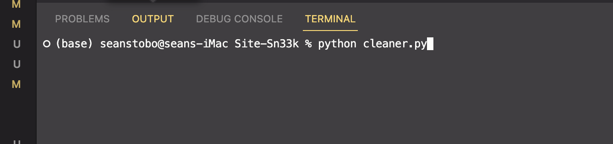
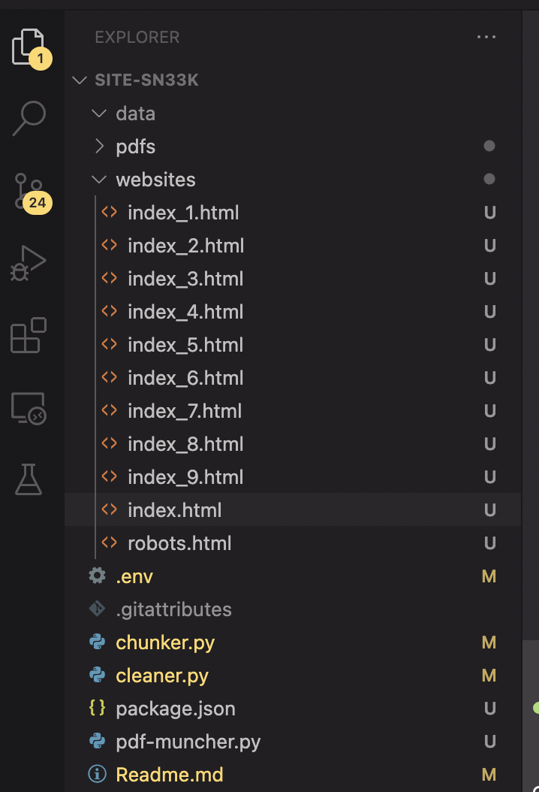
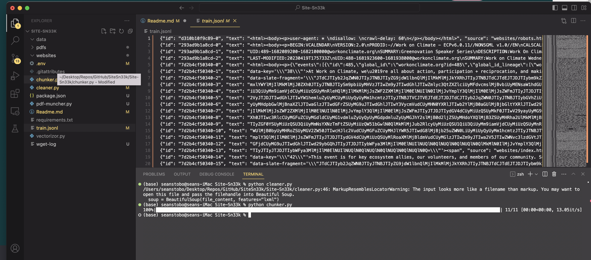
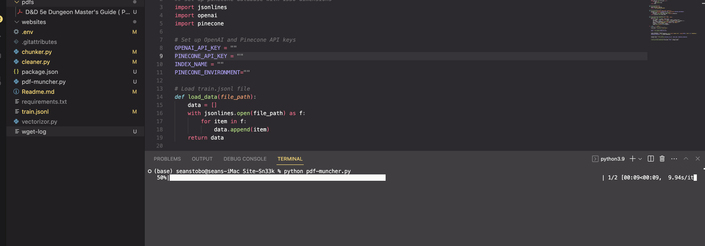
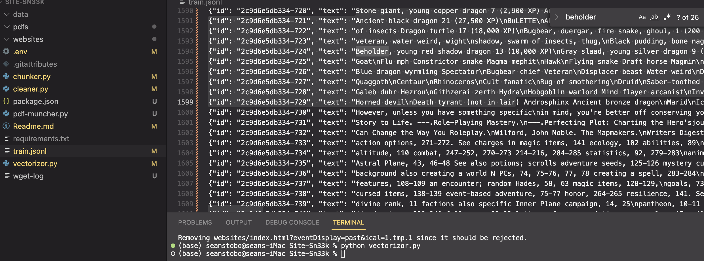

# Website Scraper, And PDF Chunker/Vectorizer for Pinecone DB

This Python repository contains a set of scripts that allow you to scrape a website, clean the data, organize it, chunk it, and then vectorize it. The resulting vectors can be used for a variety of machine learning tasks, such as similarity search or clustering.
Recently added a script to consume PDFs and add them to the training data as well.

## Files
THESE FUNCTIONS CONSUME THE FILES THEY PROCESS (only in the websites and pdfs directories)

- `cleaner.py`: This script downloads a website using wget, reads and cleans the HTML files using Beautiful Soup, and saves the resulting text files in a specified directory.
- `chunker.py`: This script splits the text files into smaller chunks, using a recursive character-based text splitter. The resulting chunks are saved in a JSONL file.
- `vectorizor.py`: This script loads the JSONL file, creates embeddings using OpenAI's text-embedding-ada-002 model, and indexes the embeddings using Pinecone. This is the one script you need api keys to run
- `pdf-muncher.py`: This will consume every PDF you put in the pdf-docs folder, and add it to the vectorized train.json

## Requirements

- Python 3.x
- OpenAI API key
- Pinecone API key
- `bs4` Python library
- `jsonlines` Python library
- `tqdm` Python library
- `tiktoken` Python library
- `pinecone-client` Python library

## Usage

We choose a site to rip

We see our 'website' folder filling up with files

We run the cleaner script

Files are normalized and cleaned up

Now we run chunker, and we can see our website files are now chunked and vectorized

Now we run our PDF muncher, and it will consume the Dungeons and Dragons monster manual pdf in our pfds folder. 

Finally, we can see our vectorized training data contains the DnD content aswell!

Now we simply run vectorizor and our Pinecone DB will get updated.

1. Clone the repository and navigate to the project directory.
2. Install the required Python libraries using `pip install -r requirements.txt`.
3. Set up your OpenAI and Pinecone API keys.
4: Download the website - copy and run the wget command: 
  `wget -r -np -nd -A.html,.txt,.tmp -P websites https://your-website`
5. Run `python cleaner.py` to download and clean the website data. - This will break down the directory structure into on list of html docs.
6. Run `python chunker.py` to split the text files into smaller chunks. This outputs train.json in the root
7. Run `python vectorizor.py` to create embeddings and index them using Pinecone. This will vectorize train.json

Note: Before running `vectorizor.py`, make sure to set up a Pinecone database with 1536 dimensions.
